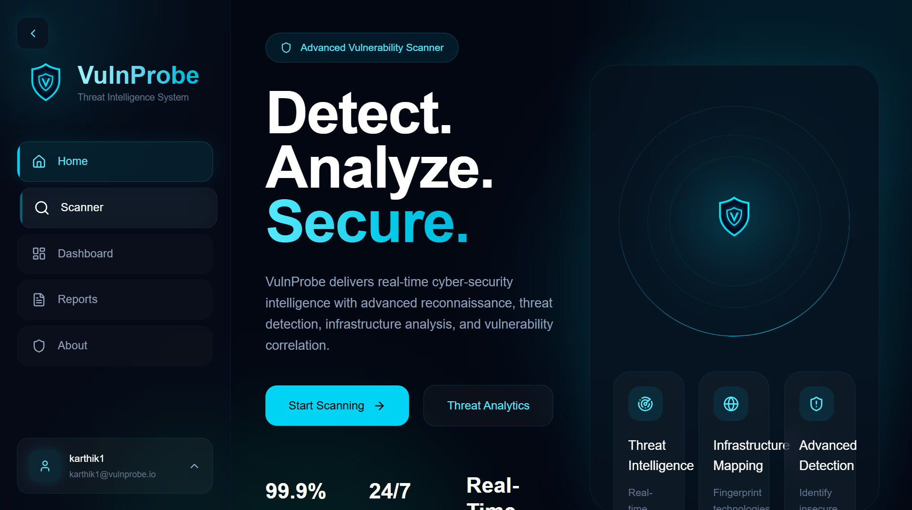
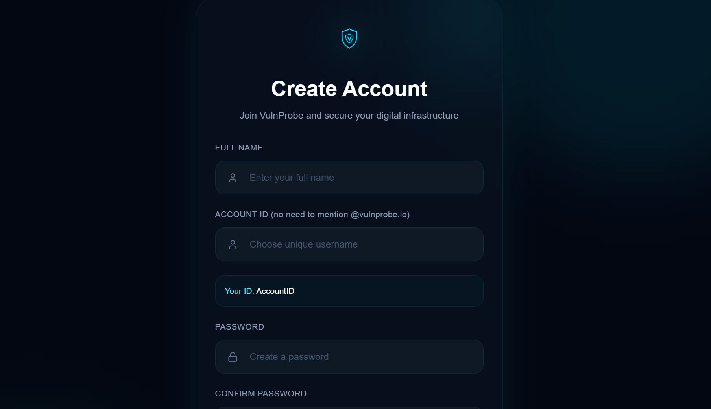
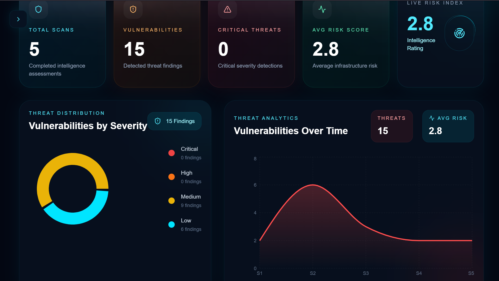
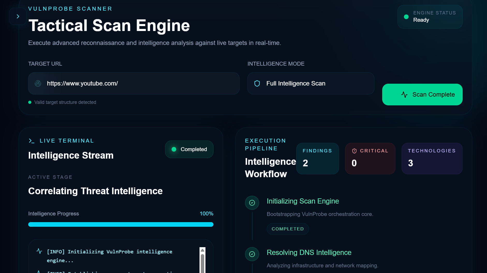
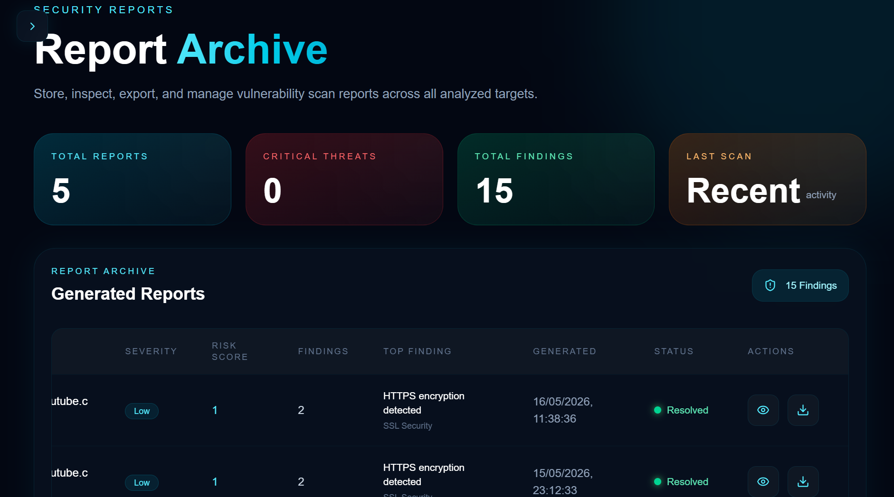
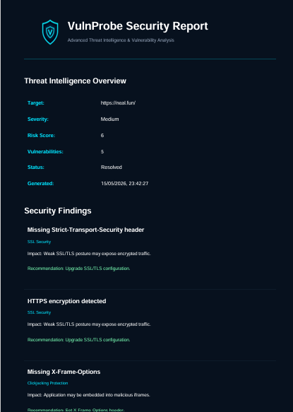

# VulnProbe

> Advanced Cyber Intelligence & Passive Vulnerability Analysis Platform

VulnProbe is a full-stack MERN cybersecurity platform focused on passive reconnaissance, security visibility, technology fingerprinting, and professional intelligence reporting.

Built with modern web technologies and cyber-intelligence architecture, VulnProbe provides a futuristic dashboard experience for analyzing web targets and generating structured vulnerability reports.

---

# 🚀 Core Features

- 🔐 JWT Authentication System
- 🛡️ Passive Vulnerability Reconnaissance
- 🌐 Technology Fingerprinting
- 📄 Professional PDF Intelligence Reports
- ⚡ Real-Time Dashboard Experience
- ☁️ Cloud Deployment Architecture
- 📊 Threat Severity Classification
- 🔍 Security Header Analysis
- 🍪 Cookie Security Inspection
- 🔗 Redirect & Infrastructure Analysis
- 📁 Persistent Scan Report Storage
- 🎨 Futuristic Cybersecurity UI/UX
- 🏠 Modern Cybersecurity Landing Page

---

# 📸 Platform Preview

## 🏠 Landing Page



---

## 🔐 Authentication Interface



---

## ⚡ Cyber Intelligence Dashboard



---

## 🔍 Scanner Intelligence Engine



---

## 📄 Vulnerability Intelligence Report



---

## 🧾 PDF Export System



---

# 🔍 Scanner Engine

VulnProbe uses a modular passive reconnaissance engine designed for security visibility and infrastructure intelligence.

## Scanner Capabilities

### ✅ SSL/TLS Analysis
- HTTPS validation
- SSL posture inspection
- Transport security visibility

### ✅ Security Header Inspection
Checks important security headers:
- Content-Security-Policy
- X-Frame-Options
- X-Content-Type-Options
- Referrer-Policy
- Strict-Transport-Security

### ✅ Technology Fingerprinting
Detects technologies such as:
- React
- Express.js
- Node.js
- Nginx
- Apache
- Cloudflare

### ✅ Cookie Security Analysis
- Secure flag detection
- HttpOnly inspection

### ✅ Reconnaissance Detection
- robots.txt analysis
- sitemap.xml inspection
- Redirect analysis
- Infrastructure visibility

### ✅ Threat Intelligence
- Risk score generation
- Severity classification
- Structured findings
- Vulnerability categorization

---

# ⚙️ Tech Stack

## Frontend
- React.js
- Tailwind CSS
- Framer Motion
- Axios
- jsPDF

## Backend
- Node.js
- Express.js
- MongoDB Atlas
- JWT
- bcryptjs

## Deployment
- Vercel
- Render
- MongoDB Atlas

---

# 🔐 Authentication System

- JWT-based authentication
- bcrypt password hashing
- Persistent login sessions
- Protected API routes
- Strong password enforcement
- Custom VulnProbe Domain IDs

Example:

```bash
username@vulnprobe.io